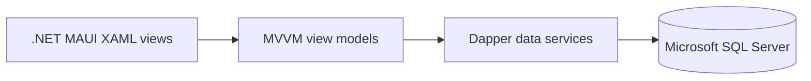

# Gunther Refuse Service — Legacy MAUI Prototype

> **Status:** Historical prototype retained to show the first version of the dispatch workflow. The previously committed database credential has been removed from the current source, but it must still be revoked or rotated and remains in Git history until that history is deliberately cleaned. This direct-database client must not be used with operational data.

This C#/.NET MAUI application explored a mobile workflow for assigning a truck, driver, and helpers to a refuse route. It predates the later architecture that separates the mobile client, ASP.NET Core API, and management portal.

## Implemented scope

- Loads available trucks and the current day's dispatch records.
- Filters selectable trucks against records already returned for the day.
- Loads employees and separates driver and helper selections.
- Captures a date, service area, truck, crew, and collection type for a dispatch record.
- Uses CommunityToolkit.MVVM commands and observable properties to connect XAML views to view models.

The employee-management and dispatch-record views remain template placeholders. PDF generation, full fleet management, and record editing are not implemented in this repository.

## Architecture and stack



- C# and .NET 8 MAUI
- XAML views with CommunityToolkit.MVVM
- Dapper and Microsoft.Data.SqlClient
- iOS target and a conditional Windows target

The direct-database client design made the first workflow quick to explore, but it places database access and trust inside the application. The successor projects move that boundary behind an API.

## Safe-use boundary

The three database services now read `GUNTHER_REFUSE_DB_CONNECTION` from the process environment and fail closed when it is absent. No replacement credential belongs in source control. The previously published credential must be revoked or rotated, and Git history must be reviewed before the exposure can be treated as contained.

If this legacy prototype is inspected locally after rotation, set the variable only for the current process and use an isolated fictional-data database:

```powershell
$env:GUNTHER_REFUSE_DB_CONNECTION = "<rotated-development-connection-string>"
```

Do not place the value in source, project files, tracked launch settings, workflow YAML, screenshots, logs, or documentation. A client-side connection string is not an appropriate production security boundary; the successor API architecture should be used for any further development.

## Verification

Dependency restore succeeded, and the Windows target built with zero errors after the credential change:

```powershell
dotnet build .\GuntherRefuse.sln -f net8.0-windows10.0.19041.0 --no-restore
```

The build reported existing warnings elsewhere in the project; those files were not changed. No database connection was attempted, and no replacement credential was created or stored during verification.

## Successor architecture

- [Refuse Dispatch API](https://github.com/mf0zz13/RefuseServiceAPI) — ASP.NET Core database boundary
- [Refuse Dispatch Mobile Client](https://github.com/mf0zz13/RefuseServiceApp) — MAUI Blazor Hybrid client
- [Refuse Dispatch Management Portal](https://github.com/mf0zz13/RefuseManagementPortal) — Blazor WebAssembly dashboard
